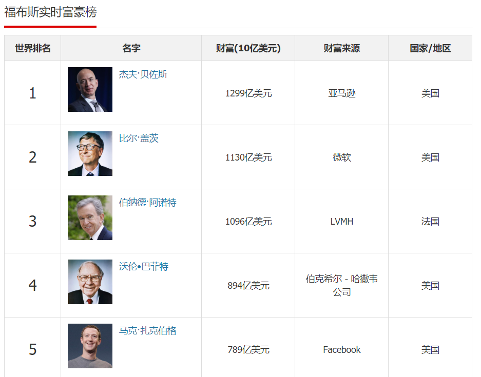
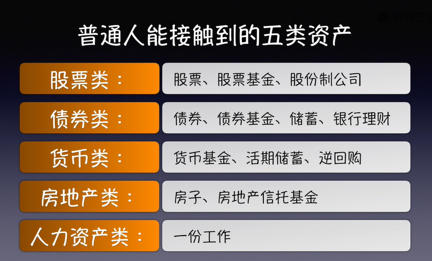
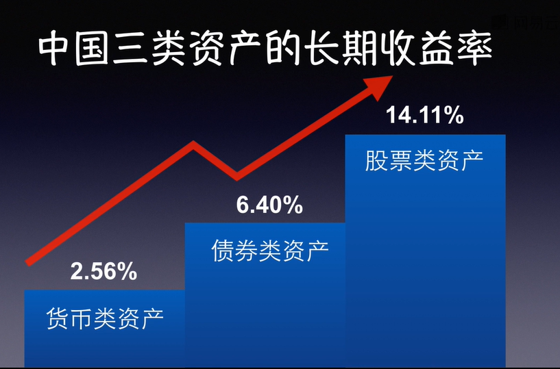
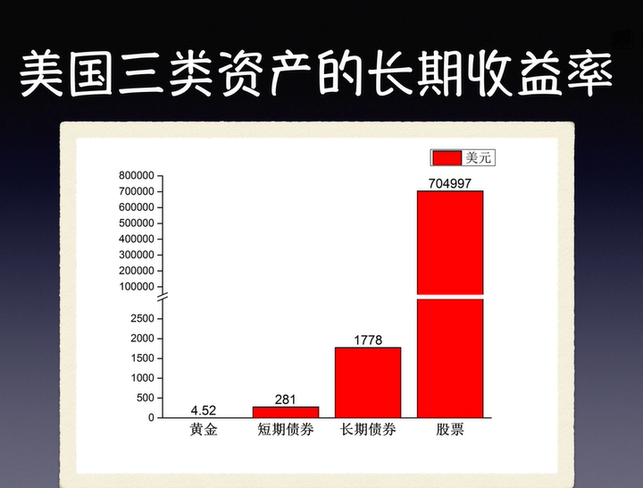

# Financial_Freedom
走向财富自由，学习基金投资的正确方法

## 1.1 成为富人的关键 - 让钱生钱
  何为富有？ 首先现金多并不等于富有，假设你有100块钱现金，你什么也不做，这100块现金5年后，10年后还是100块现金。
  真正的富有应该是资产多，资产可以给你带来源源不断的现金流。
  我们把常见的资产分为五类：

1.**第一类：股权类**
比如股票和股票基金，或者自己开一个股份制公司，这些都是股票类的资产。
2. **第二类：债券类**
国债、公司债券、债券基金、储蓄、银行理财，这些都算是债券类的资产
3. **第三类：货币类**
这里的货币不是指现金，而是说货币类的金融资产。这些货币类的金融资产是可以产生现金流的，比如说货币基金，它可以产生现金流收益。另外呢，像活期储蓄、国债回购、国债逆回购，这些也算是货币类的资产。
4. **第四类：房地产类**
我们买房子、买写字楼后出租出去了，可以有现金流的收益；我们买房地产信托基金，这也是房地产类的资产。
5. **第五类：人力资产类**
找一份工作也可以给我们带来现金流。换句话说呢，我们自己作为一个人力也是一种可以产生现金流的资产。

这是一张福布斯富豪排行榜的图片，我们可以看到，名列前茅的富豪们，他们手里都有大量的资产，这些资产也为他们带来源源不断的现金流，所以我们可以得出结论:
**要变得富有，必须要持有资产，让资产为你赚钱。**

## 1.2 什么是财富自由？
关于财务自由这个概念，我看网上有不同的说法，我就说下我个人理解的财务自由，我把他定义成**初级财务自由**：
当我们有足够的资产可以为我们创造一定的现金流，这些现金流就可以帮我们覆盖家庭的总开支，这样我们不需要工作可以过上舒服的日子。
然后这里引用一下百度百科的财富自由，我把它定位成**高级的财富自由**
>简单说来，财富自由就是有足够多的时间和足够多的钱做你想做的事情。在“基本”的生活需求得到“持续”保障的前提下，有足够的资本可以“自由”的投入到“该”做的事情中！健康和智慧如果只是前提，那么狭义的金钱就只能提到一个更高的层面，在生活面前金钱高于一切，但请注意，我们所说的并不是谈论创业而是资本运作！因为只有资本运作才能实现财富自由，如果要持续的投入过多精力就不会有自由的存在。

### 实现财务自由的前提：
持有足够多、长期现金流收益好的资产，这是财务自由的前提。

### 需要多少资产才能实现财务自由？
美国麻省理工学院学者William Bengen通过分析过去股市数据和退休案例，发现只要你退休的第一年，从退休金提取的本金不超过4.2%的花费，之后每年根据通胀率动态调整，就可以实现退休金“到死都花不完”。这就是知名的“4%法则”。

有了以上公式，我们就可以计算我们要实现财务自由需要的金额，我们可以假设一个家庭一年支出为10万元
#### 10万 / 4% = 250万

但是想要实现财务自由却并不是一个公式那么简单的问题，还要考虑到多种因素，
1. 美国经济市场与中国经济市场的不同。
2. 作为发展中国家，中国通胀水平高于美国，现在每年10万够用，未来可能要20万。
3. 4%法则对于有房贷支出的中国家庭门槛太高。
与美国不同的是，中国不少家庭供楼为主要支出项目。
房贷占比可能达到每月三分一甚至一半收入。
如此看来，对于有房贷的家庭来说，若想达成4%法则的储蓄目标可能有心无力。

### 4%法则给我们带来的思考
虽然说“4%法则”应用起来存在种种限制，但是起码，它在让我们在“开始思考如何实现财务自由”这一点上开了个好头。而且，我们还可以从“4%法则”中得到以下启示：

1. 养老金越早准备越容易实现早日自由。
2. 应对高度不确定的金融市场，我们需要借助专业机构投资者的力量。
3. 构建组合而非投资单一资产，利用资产不相关性来降低组合风险，是真正的免费午餐，世界最大对冲基金桥水创始人达里奥盛赞其为“投资圣杯”。

**总结：实现财务自由不易，但是并非不可能，我们需要科学的方法**

## 1.3 实现财务自由的方法

这里主要列出适合普通人的几个方法： **节流、开源、买基金**

- **节流**
  1. 记账
  2. 租便宜的公寓
  3. 区分想要和必要
  4. 拒绝信用卡消费
  5. 找价值观接近另一半

- **开源**
  1. 比别人更加努力工作，争取升职加薪
  2. 寻找其他被动收入来源

- **买基金**
  1. 定期投资指数基金，获取指数基金的分红
  2. 长期持有指数基金

## 1.4 什么样的资产长期收益率更高？

房地产类门槛较高，人力资产因人而异，所在我们只探讨前三类资产。

根据相关数据显示，在中国投资股票的长期收益率是最高的

我们再来看一张美国的几大资产的投资收益情况

上图是在美国1802年分别投资1美元到各类型的资产当中，200多年后的收益图

1802 年投资 1 美元到股票中，现在是 704997 美元。
1802 年投资 1 美元到长期债券中，现在是 1778 美元。
1802 年投资 1 美元到短期债券中，现在是 281 美元。
1802 年投资 1 美元到黄金中，现在是 4.52 美元。

从上面可以得出如下结论：

债券只能维持购买力不变（如果把通货膨胀加进去的话）。
黄金并不是一个很好的品种，因为黄金并没有产生现金流。
现金是最坏的结果，你的1美元200多年后还是1美元。

**总结：股票类资产是长期收益率更高的资产，想要获得长期更高的收益，我们的投资计划里面需要配置相当一部分的股票资产**