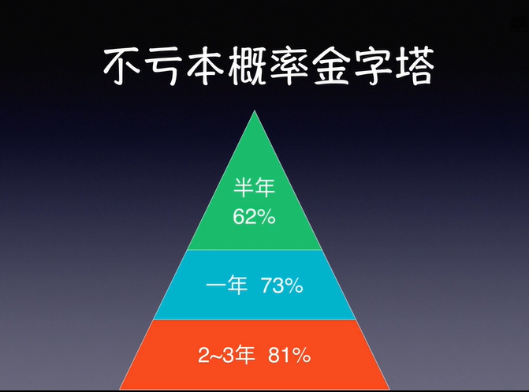

## 2.1 认识基金
经过第一章我们对资产的了解，我们认识到几类我们可以投资的资产，股票的投资收益是最高的，但是直接投资股票的风险较高，不太适合金融知识缺乏的普通人。
那么有没有不像股票那样风险高的，又可以享受到股票那样收益的投资工具呢？有的，那就是**基金**

#### 基金的概念
基金是一种投资工具，通俗的讲，我们把许多投资者的钱集中在一起，然后交给基金公司去打理，如果基金赚钱了，我们就能获得收益，如果基金亏损了，我们也要承担亏损。

我们在生活当中就接触到很多基金，举个例子：余额宝（货币基金）、养老基金、社保基金。

#### 投资基金的优势

1. 有专门的基金经理帮我们打理资金
2. 基金很方便分散风险
3. 不必频繁操作，投资省心省力（适合懒人）

## 2.2 基金的种类
基金的种类非常非常的多，这里我们只介绍我们最常见的几种: 货币基金，债券基金，股票基金

#### 1. 货币基金
货币基金的代表： 余额宝。
支付宝的余额宝，其实就是对接天弘基金公司的货币基金。
货币基金投资的是银行存款、短期债券等产品。
风险非常低，可以说投资货币基金基本是不会亏本的，但是收益也低。

#### 2. 债券基金
如果一个基金80%投资的都是债券，那就属于债券基金。
如果投资的债券是企业发行的债券，那就是企业债。
如果是国家发行的债券，那投资的就是国债。
债券基金风险中等，收益中等，注意债券基金在特殊情况下有可能亏本。

#### 3. 股票基金
股票基金投资的就是上市公司的股票，基金里有80%以上投资的股票，那就属于股票基金。
股票基金是三类基金风险最高的，收益也是最高的。

**总结： 
股票基金风险最高，收益最高。
债券基金风险中等，收益中等。
货币基金风险最低，收益最低。**

## 2.3 不同基金的投资周期

#### 1. 货币基金的投资周期
货币基金基本不会亏损，货币基金目前基本可以作为现金替代品，随取随用，按天持有即可。

#### 2. 债券基金的投资周期
债券基金的收益高一点，可以用来替代定期存款，适合中期投资。

#### 3. 股票基金的投资周期
股票基金因为很有可能波动较大，有短期大幅度下跌的可能，容易造成心理上的恐慌，所以股票基金适合持有3~5年以上，适合用来投资长期不用的资金。
投资股票基金，是个长期的投资，不是一次性买入。
**投资之前，要做好长期投资的心理准备！**

#### 一个通用标准
大多数情况下，基金的持有时间越长，亏损的风险就越低，预期收益会越高。

上图是统计所有股票基金的投资时间和亏本概率统计
根据数据统计显示，即使是风险最高的股票型基金，随着投资时间越长，亏本的概率也越来越低。

**总结：股票基金最好是长期投资，降低风险。**